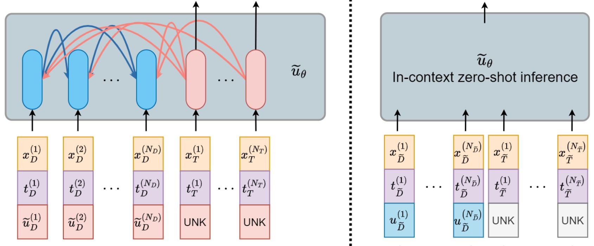
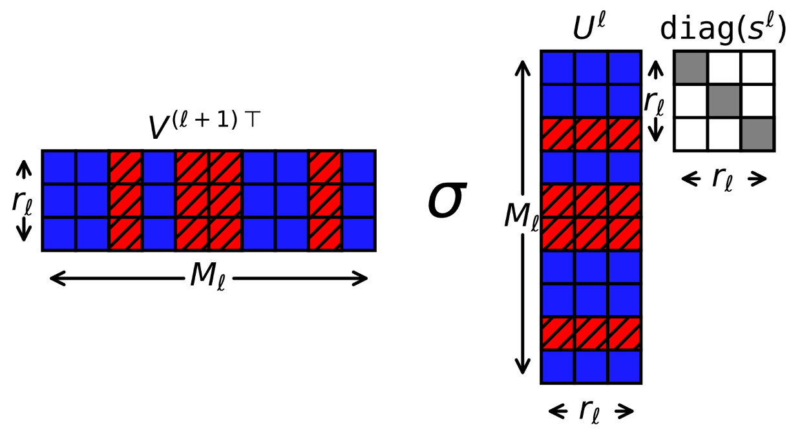

I am currently an AI researcher at [TelePIX](https://www.telepix.net/) **(Alternative military service: Technical research personnel)**.
I completed my M.S. degree advised by [Prof.Noseong Park](https://sites.google.com/view/noseong)  [(Bigdata Analytics Lab)](https://sites.google.com/view/npark/home) in the Department of Artificial Intelligence at [Yonsei University](https://www.yonsei.ac.kr/en_sc/) and continue to collaborate closely on research. My primary research areas include scientific machine learning, foundation model, implicit neural representations (INR) and satellite technology. Additionally, I have an interest in deep learning frameworks based on meta-learning, pruning and data compression method. In the future, I aspire to research related to simulation techniques by combining numerical analysis methods with scientific ML technologies (e.g., Physics-informed neural networks, Neural operator, etc.). I have a goal to build an artificial intelligence that can be interpreted mathematically and statistically. 
**I greatly enjoy collaborating with researchers who share similar interests. If you are interested in my research areas or would like to collaborate, please feel free to contact me! ([snowmoon@yonsei.ac.kr](mailto:snowmoon@yonsei.ac.kr))**

-------------------------------------------------------------------------------------------

## Publication

  
  

    
        Unveiling the Potential of Superexpressive Neural Networks in Implicit Neural Representations
     
    
        U Mudiyanselage, <strong>W Cho</strong>, M Jo, N Park, K Lee
     
    (Under review)
  

  
  

    
        MaD-Scientist: AI-based Scientist solving Convection-Diffusion-Reaction Equations Using Massive PINN-Based Prior Data
     
    
        M Kang, D Lee, <strong>W Cho</strong>, J Park, K Lee, A Gruber, Y Hong, N Park
     
    (Under review)
    <a href="https://arxiv.org/pdf/2410.06442" target="_blank">[Paper]</a> 
  

  
  

    
        FastLRNR and Sparse Physics Informed Backpropagation
     
    
        <strong>W Cho</strong>, K Lee, N Park, D Rim, G Welper
     
    (Under review)
    <a href="https://arxiv.org/pdf/2410.04001" target="_blank">[Paper]</a> 
  

  
  

    
        NeRT: Implicit Neural Representation for Time Series     
    
        <strong>W Cho*</strong>, M Jo*, K Lee, N Park
     
    (Under review)
    <a href="https://openreview.net/pdf?id=FpElWzxzu4" target="_blank">[Paper]</a> 
  

  
  

    
        Can we pre-train ICL-based SFMs for the zero-shot inference of the 1D CDR problem with noisy data?
     
    
        M Kang, D Lee, <strong>W Cho</strong>, K Lee, A Gruber, N Trask, Y Hong, N Park
     
    <strong>NeurIPS 2024 workshop</strong>
    <a href="https://openreview.net/pdf/6e57f7c19bea601f663acfc7206f2d654e6e5a01.pdf" target="_blank">[Paper]</a>
  

  
  

    
        Neural Compression for Multispectral Satellite Images
     
    
        <strong>W Cho*</strong>, S Immanuel*, J Heo, D Kwon
     
    <strong>NeurIPS 2024 workshop</strong>
    <a href="https://openreview.net/pdf?id=gk2m2OIKMs" target="_blank">[Paper]</a>
    <a href="https://github.com/SteveImmanuel/implisat" target="_blank">[Code]</a>
    <a href="https://steveimmanuel.github.io/implisat/" target="_blank">[Project]</a>
  

  
  

    
        Promoting Sparsity In Continuous-Time Models To Learn Delayed Dependence Structures     
    
      F Wu, <strong>W Cho</strong>, D Korotky, S Hong, D Rim, N Park, K Lee
     
    <strong>CIKM 2024 </strong> 
    <a href="https://openreview.net/pdf?id=2pAdYVCbU9" target="_blank">[Paper]</a>
  

  
  

    
        Parameterized Physics-informed Neural Networks for Solving Parameterized PDEs     
    
      <strong>W Cho</strong>, M Jo, H Lim, K Lee, D Lee, S Hong, N Park
     
    <strong>ICML 2024  (Oral, Top 1.52%) </strong> 
    <a href="https://openreview.net/pdf/fe697f398d9b1f2050ed2f5ebd2a000a77a89546.pdf" target="_blank">[Paper]</a>
    <a href="https://github.com/WooJin-Cho/Parameterized-Physics-informed-Neural-Networks" target="_blank">[Code]</a>
    <a href="https://icml.cc/virtual/2024/session/35281" target="_blank">[Presentation]</a>
  

  
  

    
        Extension of Physics-informed Neural Networks to Solving Parameterized PDEs     
    
      <strong>W Cho</strong>, M Jo, H Lim, K Lee, D Lee, S Hong, N Park
     
    <strong>ICLR 2024 workshop</strong> 
    <a href="https://openreview.net/forum?id=EAkRlHFLBc&referrer=%5Bthe%20profile%20of%20Woojin%20Cho%5D(%2Fprofile%3Fid%3D~Woojin_Cho1" target="_blank">[Paper]</a>
    <a href="https://github.com/WooJin-Cho/Parameterized-Physics-informed-Neural-Networks" target="_blank">[Code]</a>
  

  
  

    
      Learning Flexible Body Collision Dynamics with Hierarchical Contact Mesh Transformer
     
    
      Y Yu, J Choi, <strong>W Cho</strong>, K Lee, N Kim, K Chang, C Woo, I Kim, S Lee, J Yang, S Yoon, N Park
     
    <strong>ICLR 2024</strong> 
    <a href="https://arxiv.org/abs/2312.12467" target="_blank">[Paper]</a> 
    <a href="https://github.com/yuyudeep/hcmt" target="_blank">[Code]</a>
  

  
  

    
      Operator-learning-inspired Modeling of Neural Ordinary Differential Equations
     
    
      <strong>W Cho*</strong>, S Cho*, H Jin, J Jeon, K Lee, S Hong, D Lee, J Choi, N Park
     
    <strong>AAAI 2024</strong> 
    <a href="https://arxiv.org/abs/2312.10274" target="_blank">[Paper]</a> 
    <a href="https://github.com/WooJin-Cho/BFNO-NODE" target="_blank">[Code]</a>
  

  
  

    
        Hypernetwork-based Meta-Learning for Low-Rank Physics-Informed Neural Networks     
    
        <strong>W Cho</strong>, K Lee, D Rim, N Park
     
    <strong>NeurIPS 2023  (Spotlight, Top 3.06%)</strong>
    <a href="https://arxiv.org/abs/2310.09528" target="_blank">[Paper]</a> 
    <a href="https://github.com/WooJin-Cho/Hyper-LR-PINN" target="_blank">[Code]</a>
  

&nbsp;
&nbsp;

-------------------------------------------------------------------------------------------

## Education

* **Yonsei University**\
> M.S in Artificial Intelligence

* **Yonsei University**\
>B.S in Atmospheric science\
>B.S in Electrical electronic engineering

* **Sejong Science High School**

-------------------------------------------------------------------------------------------

## Career

* **[Telepix](https://www.telepix.net/)** ( Jun 2024 - Present )\
> AI research team (Alternative military service)

* **Arizona State University** ( Jan 2024 - Jun 2024 )\
> Visiting Researcher (hosted by [Prof.Kookjin Lee](https://klee44.github.io/))

-------------------------------------------------------------------------------------------

## Invited Talk

* Scientific Machine Learning (hosted by [KIAS](https://kias.re.kr/kias/activities/seminars/view.do?seqno=PGN1720231223-0002&menuNo=408014&schoolsCd=&centrspgmsCd=AI&sdate=2024-01-01&edate=&mjrcdnm=&searchCnd=1&searchWord=&pageIndex=1))
* Parameterized Physics-informed Neural Networks for Parameterized PDEs (hosted by [ML2](https://www.kc-ml2.com/))
* Latest Trends in Machine Learning based Physics Simulation (hosted by [Samsung Electronics](https://www.samsung.com/))
* Physics-informed Neural Networks for Solving PDEs (hosted by [Alsemy](https://www.alsemy.com/))

-------------------------------------------------------------------------------------------

## Academic Services 

Reviewer or Program Committee Member for Conference

* Conference on Neural Information Processing Systems (NeurIPS): 2024
* International Conference on Machine Learning (ICML): 2025

-------------------------------------------------------------------------------------------

## Scholarship

* ICML Financial Aid (2024) [[Link]](https://icml.cc/Conferences/2024/FinancialAid)
* Google Conference Scholarship (2024) [[Link]](https://buildyourfuture.withgoogle.com/scholarships/google-conference-scholarships)
* AAAI Scholarship (2024) [[Link]](https://aaai.org/aaai-conference/aaai-24-student-scholarhip-volunteer-program/)
* ILJU Academy and Culture Foundation (2019-2022) [[Link]](http://www.taekwanggroup.co.kr/homepage/eng/iljuFoundationIntro.do)
